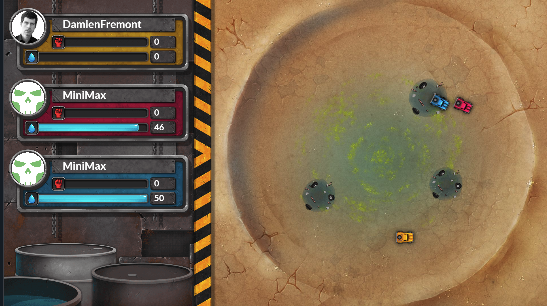

# contests-mean_max
6,604 CodinGamers have registered to this contest

https://www.codingame.com/contests/mean-max

This is a league based challenge.
For this challenge, multiple versions of the same game are available. Once you have proven your skills on this first version, you will access a higher league and extra rules will be unlocked.

---

## The Goal

Gather more water than your enemies

## Rules

The game is played on a circular map with 3 players, each spawning with a Reaper. 

Players move simultaneously and compete to gather water from the Wrecks of Tankers.

### The map
- The game is played in a circular area of radius 6000.

### The Reapers
- The Reaper harvests 1 water per turn from each Wreck it finishes the turn in.
- Your Reaper can X Y THROTTLE to accelerate towards (x,y).

### Actions 
Every turn, your Reaper must either:
- X Y THROTTLE to accelerate towards (x,y)
- WAIT

The game is over once any player reaches 50 water or after 200 turns.

### Victory Conditions
Have more water than your opponents at the end of the game.
 
### Lose Conditions
You do not respond in time.

---

## Game Input

### Input for one game turn
First 3 lines: score of each player in order of id (you are player 0)

Next 3 lines: an integer (placeholder for the next leagues)

Line 7: an integer unitCount 

Next unitCount lines: unitId, unitType, playerId, mass, radius, x, y, vx, vy, extra, extra2 
- unitId The unit's id
- unitType 0 (Reaper), 4 (Wreck)
- playerId id of the player for Reapers, -1 otherwise
- mass Mass of the unit, -1 for Wrecks
- radius The radius of the unit
- x and y The position of the unit
- vx and vy The speed of the unit
- extra The quantity of water for Wrecks, -1 otherwise
- extra2 Always -1 (placeholder for the next leagues)

### Output for one game turn
One line for your Reaper:
- X Y THROTTLE three integers with (X,Y) the direction of your acceleration and 0 ≤ THROTTLE ≤ 300
- WAIT

Two lines of:
- WAIT (placeholder for the next leagues)

### Constraints
- Response time per turn ≤ 50ms 
- Response time for the first turn ≤ 1000ms

