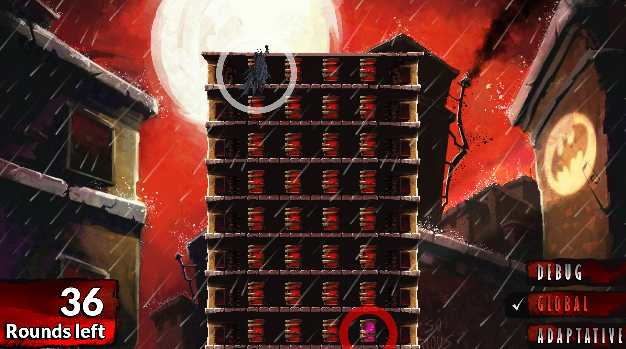
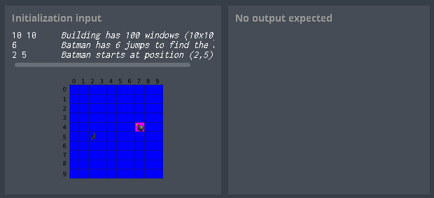
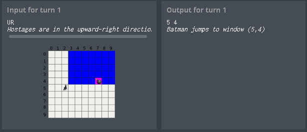
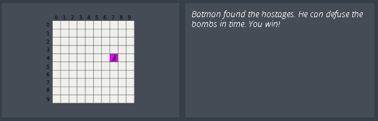

# codingame-training-medium-shadows_of_the_knight_episode_1
Difficulty : Medium Community success rate: 69%

https://www.codingame.com/training/medium/shadows-of-the-knight-episode-1

---

## The Goal

Batman will look for the hostages on a given building by jumping from one window to another using his grapnel gun. Batman's goal is to jump to the window where the hostages are located in order to disarm the bombs. Unfortunately he has a limited number of jumps before the bombs go off...

## Rules

Before each jump, the heat-signature device will provide Batman with the direction of the bombs based on Batman current position: 
- U (Up)
- UR (Up-Right)
- R (Right)
- DR (Down-Right)
- D (Down)
- DL (Down-Left)
- L (Left)
- UL (Up-Left)

Your mission is to program the device so that it indicates the location of the next window Batman should jump to in order to reach the bombs' room as soon as possible.

Buildings are represented as a rectangular array of windows, the window in the top left corner of the building is at index (0,0).

## Note

For some tests, the bombs' location may change from one execution to the other: the goal is to help you find the best algorithm in all cases.

The tests provided are similar to the validation tests used to compute the final score but remain different.

---

## Game Input

The program must first read the initialization data from standard input. Then, within an infinite loop, read the device data from the standard input and provide to the standard output the next movement instruction.

### Initialization input
Line 1 : 2 integers W H. The (W, H) couple represents the width and height of the building as a number of windows.

Line 2 : 1 integer N, which represents the number of jumps Batman can make before the bombs go off.

Line 3 : 2 integers X0 Y0, representing the starting position of Batman.

### Input for one game turn
The direction indicating where the bomb is.

### Output for one game turn
A single line with 2 integers X Y separated by a space character. (X, Y) represents the location of the next window Batman should jump to. X represents the index along the horizontal axis, Y represents the index along the vertical axis. (0,0) is located in the top-left corner of the building.

### Constraints
- 1 ≤ W ≤ 10000
- 1 ≤ H ≤ 10000
- 2 ≤ N ≤ 100
- 0 ≤ X, X0 < W
- 0 ≤ Y, Y0 < H
- Response time per turn ≤ 150ms
- Response time per turn ≤ 150ms

## Example

---

## Synopsis

Batman: “Come on Joker, give it up, I know you're hiding in here somewhere, you can't escape from me.”

Joker: “Oh, but I think I can Batman! Just look behind you. See these buildings over there? In each one of them there is a room full of hostages trapped with my sweet little Joker-BOMBS. They are about to go off any minute now in a marvellous firework! KA-BOOOM!!!”

Batman: “Damn you Joker, you won't get away with this.”

Joker: “So what will it be Batman? Do you want to waste time chasing me or will you try to save the poor, poor hostages? I'd hurry if I were you...Ha-ha-ha”

Batman: “Alfred, I don't have time to check all the buildings' windows: I need a gadget to help me.”

Alfred: “Certainly sir. I have the perfect device: it can track the bombs heat signature. I'm sending it to you as soon as I'm done reprogramming it.”

Joker: “So long Batman! Ha-ha-ha OH-OH-OH...”