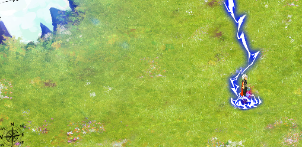
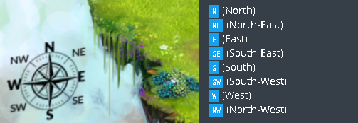
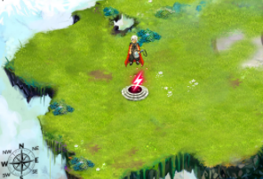

# codingame-training-easy-the_descent
Difficulty : Easy Community success rate: 62%

https://www.codingame.com/training/easy/power-of-thor-episode-1

## The Goal

Your program must allow Thor to reach the light of power.

## Rules

Thor moves on a map which is 40 wide by 18 high. Note that the coordinates (X and Y) start at the top left! This means the most top left cell has the coordinates "X=0,Y=0" and the most bottom right one has the coordinates "X=39,Y=17".

Once the program starts you are given:
- the variable lightX: the X position of the light of power that Thor must reach.
- the variable lightY: the Y position of the light of power that Thor must reach.
- the variable initialTX: the starting X position of Thor.
- the variable initialTY: the starting Y position of Thor.

At the end of the game turn, you must output the direction in which you want Thor to go among:
	

Each movement makes Thor move by 1 cell in the chosen direction.
 
 
### Victory Conditions
- You win when Thor reaches the light of power
 
### Lose Conditions
- Thor moves outside the map

Initial phase
Thor starts on the map at position (3, 6). The light is at position (3, 8).

Round 1
Action S: Thor moves towards south.
New position is (3, 7).

Round 2
Action S: Thor moves towards south.
New position is (3, 8).

## Note
Do not forget to execute the tests from the "Test cases" panel.

Beware: the tests given and the validators used to compute the score are slightly different in order to avoid hard coded solutions.

## Game Input

The program must first read the initialization data from the standard input, then, in an infinite loop, provides on the standard output the instructions to move Thor.

### Initialization input
Line 1: 4 integers lightX lightY initialTX initialTY. (lightX, lightY) indicates the position of the light. (initialTX, initialTY) indicates the initial position of Thor.

### Input for a game round
Line 1: the number of remaining moves for Thor to reach the light of power: remainingTurns. You can ignore this data but you must read it.

### Output for a game round
A single line providing the move to be made: N NE E SE S SW W ou NW

### Constraints
- 0 ≤ lightX < 40
- 0 ≤ lightY < 18
- 0 ≤ initialTX < 40
- 0 ≤ initialTY < 18
- Response time for a game round ≤ 100ms

## Synopsis

The final battle of Ragnarök, the twilight of the gods is approaching. You incarnate Thor who is participating in this final battle against all the forces of evil, led by Loki, Thor's wizard brother.

Thor was wounded during a previous battle against Fenrir, the wolf-god. During the battle, Loki took advantage of the general confusion and used his magic to annihilate the magical powers of Thor’s hammer, Mjöllnir, by separating it from his soul: the light of power.

Thor, who now feels very weak, must find and reach the light of power, as fast as possible, since it is the only thing which can restore his and Mjollnir's powers.