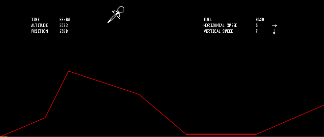
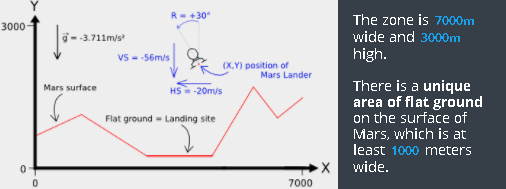
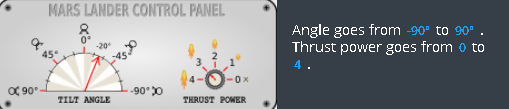
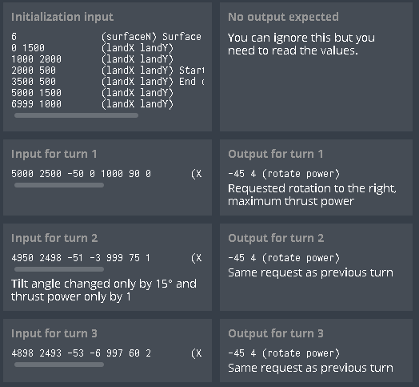

# codingame-training-medium-mars_lander_episode_2
Difficulty : Medium Community success rate: 29%

https://www.codingame.com/training/medium/mars-lander-episode-2

---

## The Goal

The goal for your program is to safely land the "Mars Lander" shuttle, the landing ship which contains the Opportunity rover. Mars Lander is guided by a program, and right now the failure rate for landing on the NASA simulator is unacceptable.

This puzzle is the second level of the "Mars Lander" trilogy. The controls are the same as the previous level but you must now control the angle in order to succeed.

## Rules

Built as a game, the simulator puts Mars Lander on a limited zone of Mars sky.

Every second, depending on the current flight parameters (location, speed, fuel ...), the program must provide the new desired tilt angle and thrust power of Mars Lander:

The game simulates a free fall without atmosphere. Gravity on Mars is 3.711 m/s² . For a thrust power of X, a push force equivalent to X m/s² is generated and X liters of fuel are consumed. As such, a thrust power of 4 in an almost vertical position is needed to compensate for the gravity on Mars.

For a landing to be successful, the ship must:
- land on flat ground
- land in a vertical position (tilt angle = 0°)
- vertical speed must be limited ( ≤ 40m/s in absolute value)
- horizontal speed must be limited ( ≤ 20m/s in absolute value)

## Note

Tests and validators are only slightly different. A program that passes a given test will pass the corresponding validator without any problem.

---

## Game Input

The program must first read the initialization data from standard input. Then, within an infinite loop, the program must read the data from the standard input related to Mars Lander's current state and provide to the standard output the instructions to move Mars Lander.

### Initialization input
Line 1: the number surfaceN of points used to draw the surface of Mars.

Next surfaceN lines: a couple of integers landX landY providing the coordinates of a ground point. By linking all the points together in a sequential fashion, you form the surface of Mars which is composed of several segments. For the first point, landX = 0 and for the last point, landX = 6999

### Input for one game turn
A single line with 7 integers: X Y hSpeed vSpeed fuel rotate power
- X,Y are the coordinates of Mars Lander (in meters).
- hSpeed and vSpeed are the horizontal and vertical speed of Mars Lander (in m/s). These can be negative depending on the direction of Mars Lander.
- fuel is the remaining quantity of fuel in liters. When there is no more fuel, the power of thrusters falls to zero.
- rotate is the angle of rotation of Mars Lander expressed in degrees.
- power is the thrust power of the landing ship.

### Output for one game turn
A single line with 2 integers: rotate power :
- rotate is the desired rotation angle for Mars Lander. Please note that for each turn the actual value of the angle is limited to the value of the previous turn +/- 15°.
- power is the desired thrust power. 0 = off. 4 = maximum power. Please note that for each turn the value of the actual power is limited to the value of the previous turn +/- 1.

### Constraints
- 2 ≤ surfaceN < 30
- 0 ≤ X < 7000
- 0 ≤ Y < 3000
- -500 < hSpeed, vSpeed < 500
- 0 ≤ fuel ≤ 2000
- -90 ≤ rotate ≤ 90
- 0 ≤ power ≤ 4
- Response time per turn ≤ 100ms

### Example

---

## Synopsis

Same place, the next day. You have joined Jeff and Mike in the crisis meeting room of the Kennedy Space Center.
 
“OK, I see you got the general idea. Mike, what do you think of our new recruit so far? ”

“There's still a long way to go... ”

“Oh c'mon Mike, you're always so skeptical! ”
 
Jeff turns and glares at you with his steel-blue eyes.

“ But he IS right! This first test was just a warm-up. Now you'll need to deal with more challenging situations. You see, we must be prepared to face anything, the success of the mission depends upon it! ”
