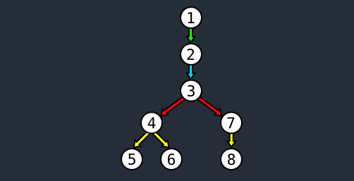
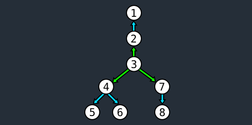
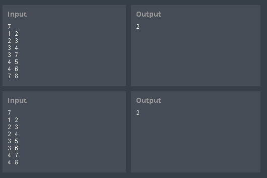

# codingame-training-medium-teads_sponsored_contest
Difficulty : Medium Community success rate: 45%

https://www.codingame.com/training/medium/teads-sponsored-contest

---

## The Goal

Here at Teads we know that to maximize the impact of an advertisement, the message needs to spread far and quickly.
 
You are given data to calculate viral potential, represented by a network of people ready to relay a message to more people.
We can assume this network contains no cyclic relation. 
For example, if person #1 has a relation with person #2 and if person #2 has a relation with person #3, then it is impossible for #3 to have a direct relation with #1.
 
When an individual broadcasts a message, it is counted as a single step, meaning that the time it takes to broadcast the message is independant from the amount of people in direct relation with the individual. We will consider that this event will always take 1 hour.
 
Here is an example with persons #1, #2, #3, #4, #5, #6, #7 and #8 linked like so:
 

 
Here, by choosing to start propagation of the message with person #1, 4 hours will be needed to share the message to the entire network:
 

 
1.   #1 relays the message to #2
2.   #2 then relays it to #3
3.   #3 relays it to #4 and #7.
4.   #4 relays it to #5 and #6, while #7 relays it to #8
 
If we decide now to start the propagation with person #3, then only 2 hours are needed:
 

 
1.   #3 relays the message to #2, #4 and #7
2.   #2 relays it to #1 ; #4 relays it to #5 and #6 ; #7 relays it to #8
 
In this exercice, your mission consists in finding the minimal amount of hours it would take for a message to propagate across the entire network given to you as input.

---

## Game Input

### Input
Line 1: N the number of adjacency relations.

N next lines: an adjancency relation between two people, expressed as X (space) Y, meaning that X is adjacent to Y.

### Output
The minimal amount of steps required to completely propagate the advertisement.

### Contraints
- 0 < N< 150000
- 0 ≤ X,Y < 200000

### Examples

