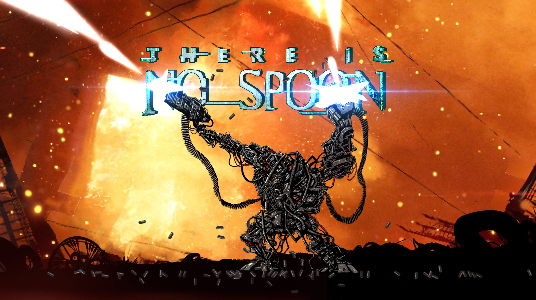
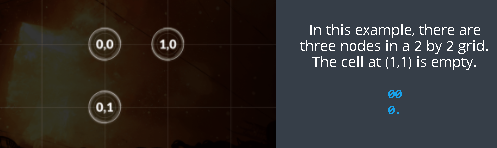
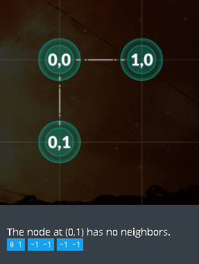

# codingame-training-medium-there_is_no_spoon_episode_1
Difficulty : Medium Community success rate: 50%

https://www.codingame.com/training/medium/there-is-no-spoon-episode-1

## The Goal

The game is played on a rectangular grid with a given size. Some cells contain power nodes. The rest of the cells are empty.

The goal is to find, when they exist, the horizontal and vertical neighbors of each node.

## Rules

To do this, you must find each (x1,y1) coordinates containing a node, and display the (x2,y2) coordinates of the next node to the right, and the (x3,y3) coordinates of the next node to the bottom within the grid.

If a neighbor does not exist, you must output the coordinates -1 -1 instead of (x2,y2) and/or (x3,y3).

You lose if:
- You give an incorrect neighbor for a node.
- You give the neighbors for an empty cell.
- You compute the same node twice.
- You forget to compute the neighbors of a node.
 
### Victory Conditions
You win when all nodes have been correctly displayed.
 
### Example

### Note

Don’t forget to run the tests by launching them from the “Test cases” window.

Warning: the tests provided are similar to the validation tests used to compute the final score but remain different. This is a "hardcoding" prevention mechanism. Harcoded solutions will not get any points.

Regarding the viewer, note that:
- A debug mode is available from the settings panel (the dented wheel)
- You can zoom/unzoom with the mouse wheel and move using drag'n drop (useful for large grids)

## Game Input

The program must first read the initialization data from standard input. Then, provide to the standard output one line per instruction.

### Initialization input
Line 1: one integer width for the number of cells along the x axis.

Line 2: one integer height for the number of cells along the y axis.

Next height lines: A string  line  containing  width  characters. A dot . represents an empty cell. A zero 0 represents a cell containing a node.

### Output for one game turn
One line per node. Six integers on each line:   x1  y1  x2  y2  x3  y3

Where:
- (x1,y1) the coordinates of a node
- (x2,y2) the coordinates of the closest neighbor on the right of the node
- (x3,y3) the coordinates of the closest bottom neighbor

If there is no neighbor, the coordinates should be -1 -1.

### Constraints
- 0 < width ≤ 30
- 0 < height ≤ 30
- 0 ≤ x1 < width
- 0 ≤ y1 < height
- -1 ≤ x2, x3 < width
- -1 ≤ y2, y3 < height

Alloted response time to first output line ≤ 1s.

Response time between two output lines ≤ 100ms

## 25th of April 2699, 12:01 - Zion...

The machines are closing in on Zion, the human defenses are setting up for one last stand.
The human army is largely comprised of APUs (Armored Personal Unit), giant exoskeletons equipped with fully automatic firearms controlled via a grip-sensor relayed to a mechanical machine gun trigger. Every single one of the pilot's movements is mapped onto the robotic bones of the APU, effectively creating a super-soldier.

Each APU is equipped with an 'R-Chip'. These contain a little group of programs that regulate ammunition flow, namely to avoid bullets getting stuck in the mechanism during the chaos of battle. A single squib would cause immediate neutralization of the soldier.
There are several layers of abstraction on the R-Chips from low-level hardware programming to high-level software.

You are part of the team of programmers for the top abstraction layer of the R-Chips.

Your assignment is as follows: Create the initialization code for the R-Chip which must verify the connections in the APU's systems and output all the links between components.
This will enable the soldiers to activate their weapons. Without a working piece of code, many soldiers will be lost without having been able to fire a single shot.
